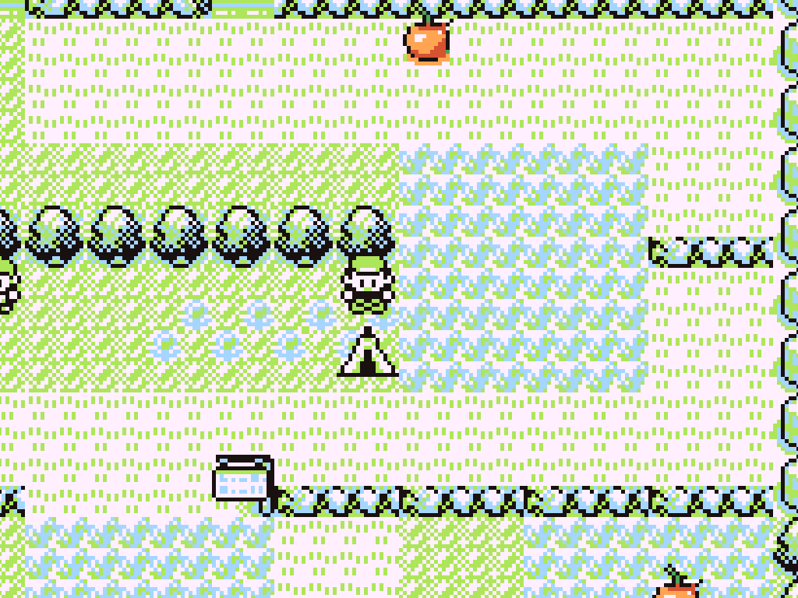
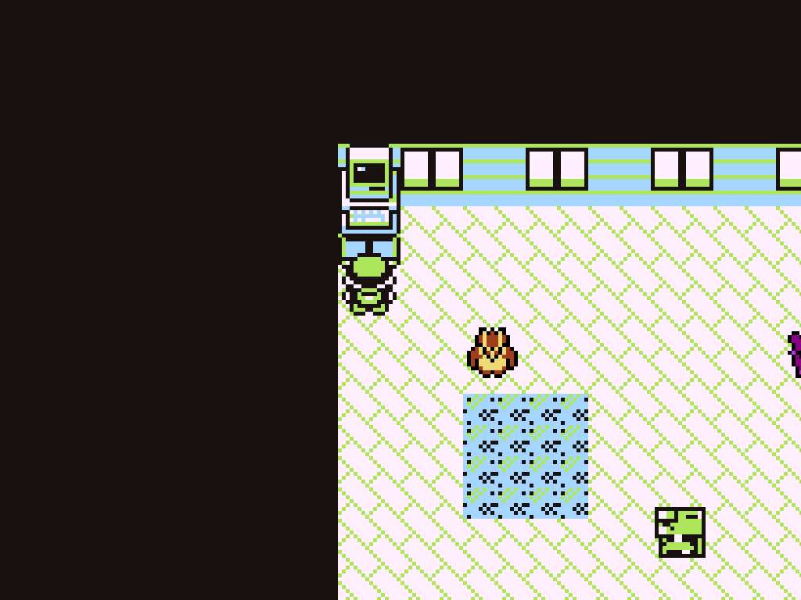
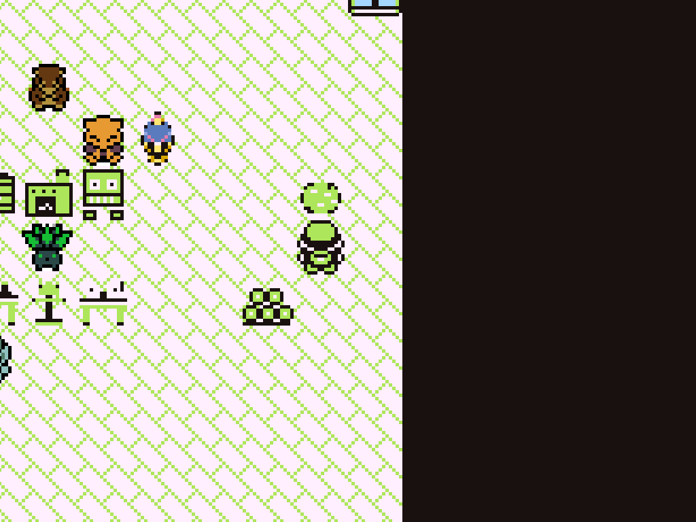
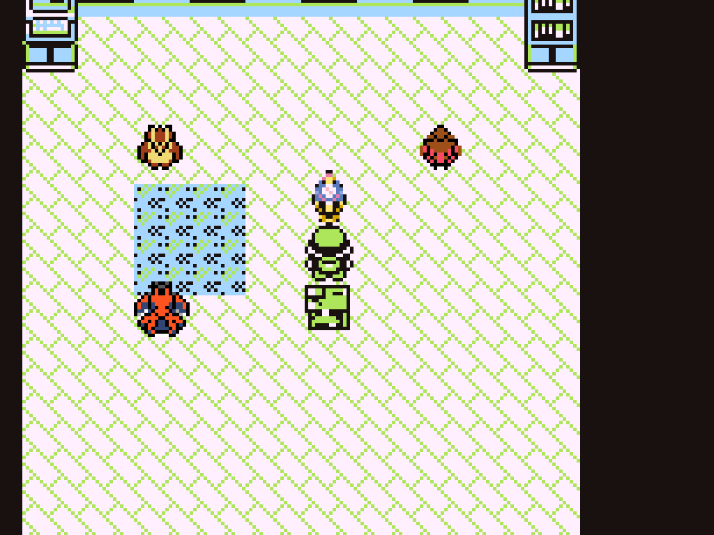
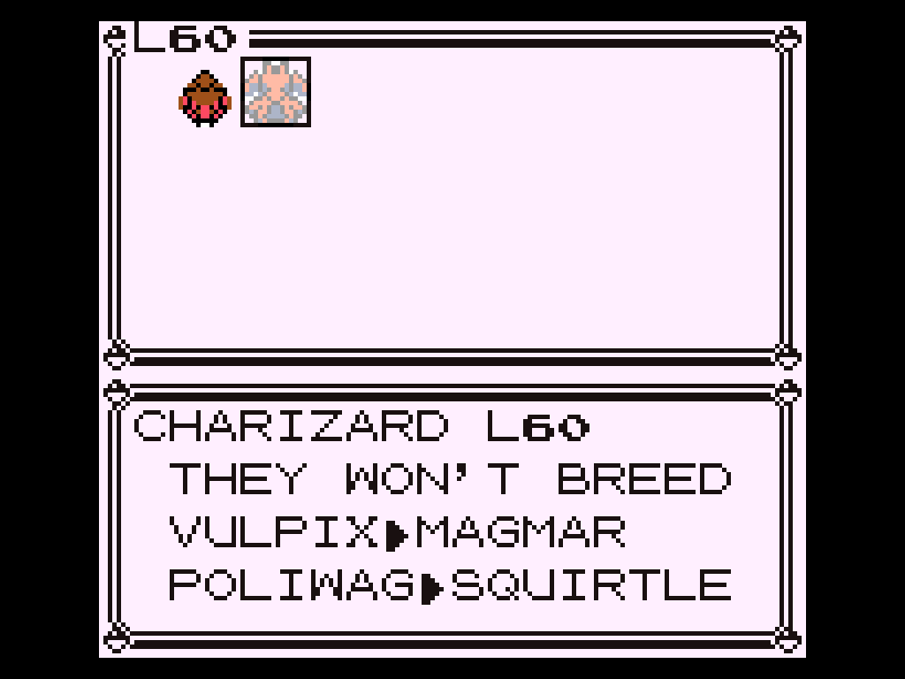
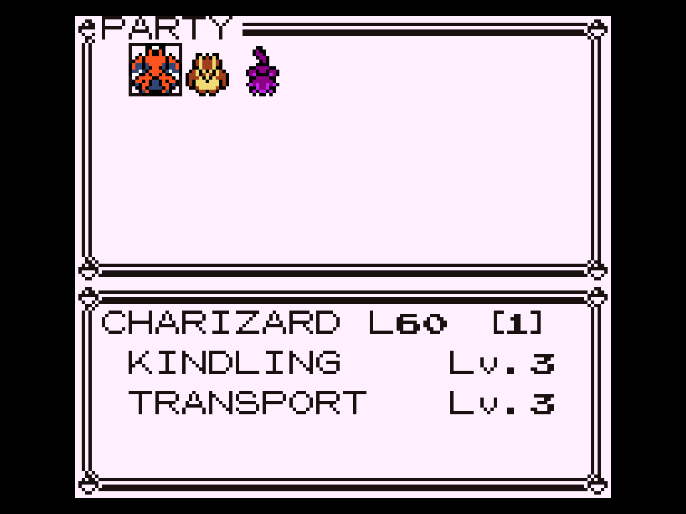
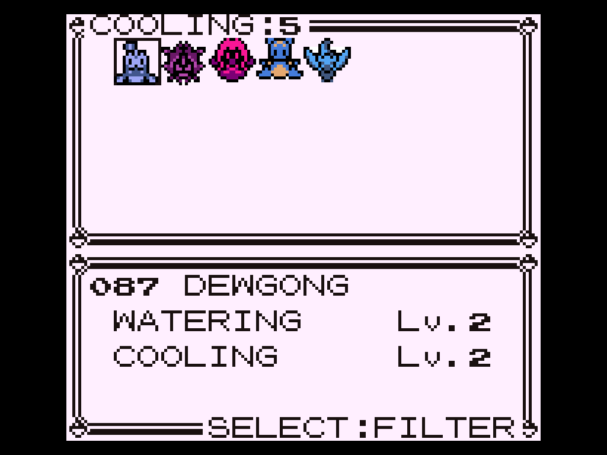
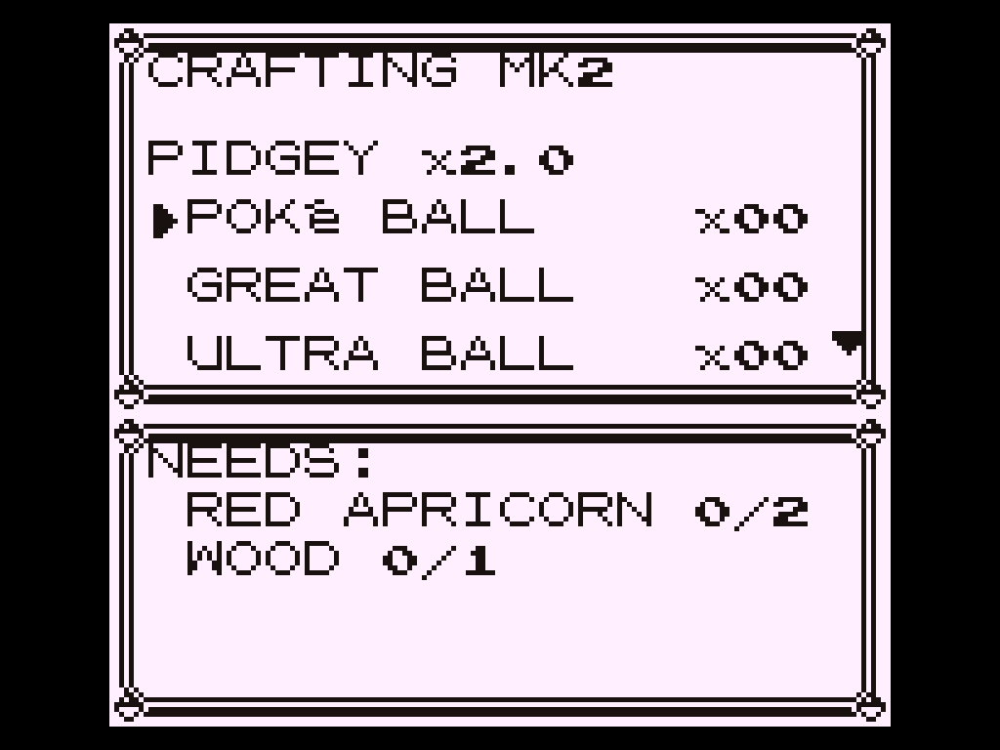
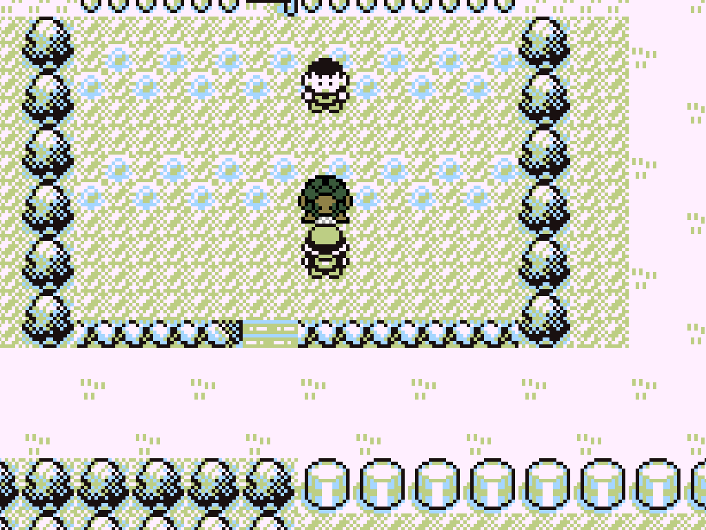
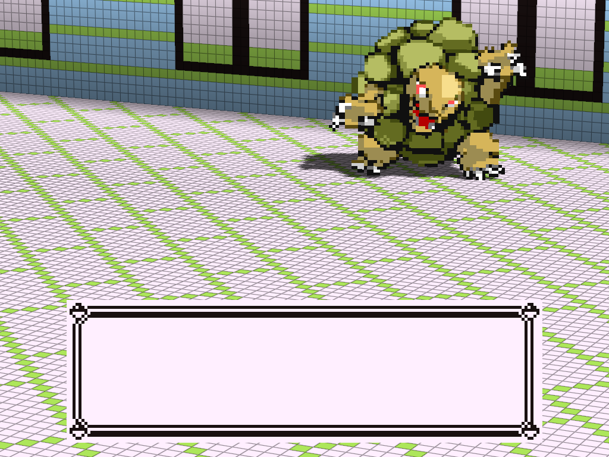

# Palworld Crafting

A Palworld-style survival economy inside Gen 1 Pokemon Red, for
[gen1recomp](https://github.com/bryanthaboi/gen1recomp): build a
secret base, put your POKeMON to work by type, breed for egg moves
and stars, craft everything, and duel hourly street bosses.

## Install

1. Grab the latest `palworld_crafting-<version>.zip` from
   [Releases](https://github.com/argallo/palworld_crafting/releases)
   (or use **Import mod .zip** in the launcher's mod manager).
2. Unpack it into your `mods/` folder so it sits at
   `mods/palworld_crafting/`.
3. Enable it in the mod manager. A **DIFFICULTY** option (NORMAL /
   HARD) lives in the mod's options.

Best experienced on a fresh save. It loads fine mid-save too: your
existing POKeMON join the star ladder at star 1.

## Screenshots

| | |
|---|---|
|  |  |
| Pitch your **SECRET BASE** anywhere with SELECT — apricorn bushes grow along every route | Inside: a real working **PC** and your crew wandering the room |
|  |  |
| The workshop: **generator, furnace, woodpile**, tables — staffed by type-matched workers | The **EGG INCUBATOR** warming a hatchling beside the grape plot |
|  |  |
| The assign screen teaches every pairing: **VULPIX▶MAGMAR**, partner needed or not | **Star ranks** `[n]` on the base screens — condense to climb |
|  |  |
| The **WORK SKILLS** grid, filtered to one job with SELECT | The **MK2 table**: live queue, helper speed, and material costs |
|  |  |
| A **street boss GOLEM** looming in Pewter City | Eight shards later: the **summoned, catchable** empowered form |

## Overview

Removes purchasable Poké Balls and replaces them with a material
economy: gather apricorns and ore, build stations inside a placeable
secret base, and staff those stations with Pokémon assigned to work
roles.

---

## 1. Materials

### Apricorns

| Source | Rate | Notes |
|---|---|---|
| Wild battle win | 85% | 1 material roll |
| Trainer battle win | 100% | 1 material roll, guaranteed |
| Overworld pickup | — | 48 fixed spots, one-time |
| Former ball pickups | — | 1:1 substitution |

A material roll checks the specialty drops first (seed → organ → ore
→ wood, rates below) and pays an apricorn when none procs. Apricorn
color is selected by the defeated Pokémon's level, mirroring ball
tiers:

- `< L12` → mostly RED
- `L12–L30` → mostly BLU
- `> L30` → mostly YLW

Global drop weights: RED 60 / BLU 28 / YLW 12.

Overworld pickups use original 16×16 sprite art, color-coded, and are
distributed across Kanto's land routes. Interaction is the standard
item-ball flow (walk up, press A). Color tiers by region: RED near
Pallet, BLU mid-Kanto, YLW on the late routes. Coordinates live in a
single `SPOTS` table in `main.lua`.

Ball pickups that vanilla leaves on the ground — visible item balls
and hidden finds alike — now yield the equivalent apricorn: Poké →
RED, Great → BLU, Ultra → YLW. The Master Ball story gift is
unchanged.

Surplus apricorns sell at any mart for half price.

### Other drops

| Material | Source | Rate |
|---|---|---|
| WOOD | Win, defeated level `< L12` | 35% |
| ORE | Win vs. ROCK or GROUND type, any level | 25% |
| TYPE ORGAN | Any win | 15%, typed to one of the defeated Pokémon's own types |
| GRAPE SEED | Win vs. BUG, GRASS, or FLYING | 10% |

Rates roll in priority order (seed → organ → ore → wood → apricorn),
one drop per roll.

New saves start with 3 WOOD and no other items. All other equipment
is crafted.

Battle drops are deferred to the first quiet overworld frame after
any running script or text box completes, so they never interrupt
dialog.

---

## 2. Secret base

Granted alongside the Pokédex when Oak hands it over, together with
the CRAFT TABLE. One base per save.

- Press SELECT in the overworld (or USE from the bag) to place it on
  the facing tile. With a base already placed, SELECT from inside the
  base's own map offers to pack it up; from anywhere else it reports
  the base's location.
- Press A on the entrance for ENTER / PACK UP / CANCEL.
- Interior is a private room with wallpapered walls, windows, and a
  wooden floor. Exit via the two-cell door mat on the south edge
  (step on it, press down — same as a mart).
- Wall/floor palette follows the region the entrance tile sits in.
- A fully functional Pokémon PC sits in the top-left corner: Bill's
  PC boxes, item storage, and Oak's rating, identical to the Pokémon
  Center menu.
- First entry finds an item ball containing one FERM.JUICE.
- Room contents persist through pack-up and re-placement. Everything
  stays where it was left.

Capacity: 8 assigned Pokémon, 12 after the east-wing expansion.

### Base roster UI

While inside the base, the Start menu gains a **BASE POKéMON** row.
Sprite grid of the current crew; the panel below live-updates with
the highlighted Pokémon's level, star rank, and jobs. SELECT opens
the hire picker, which grids the party and every PC box (source shown
on the top border) with each candidate's work skills visible before
commit. Press A on a crew member for TO PARTY / TO PC / SKILLS.

Standard constraints apply: at least one Pokémon must stay in the
party, and full parties/boxes are rejected with a message rather than
silently failing.

Assigned Pokémon wander the room and are talkable.

**Sprite dependency (optional).** Base Pokémon use per-species
overworld sprites read directly from the Overworld Encounters mod's
follower art. Keep that mod's folder in `mods/` and the sprites load
even if the mod itself is disabled — no roaming-encounter behavior is
pulled in. Delete the folder and base Pokémon fall back to a generic
sprite. Nothing in this mod requires it.

---

## 3. Work suitabilities

Every Pokémon is a worker. Each of its types maps to one job:

| Type | Job | Type | Job |
|---|---|---|---|
| NORMAL | Handiwork | ROCK | Mining |
| GRASS | Gathering | FLYING | Transport |
| BUG | Planting | POISON | Medicine |
| WATER | Watering | FIGHTING | Training |
| FIRE | Kindling | PSYCHIC | Research |
| ELECTRIC | Generating | GHOST | Night shift |
| ICE | Cooling | DRAGON | Overseeing |
| GROUND | Lumbering | | |

All fifteen suitabilities are used by at least one station.

Job level is set by evolution stage — evolving is the promotion.
Curated legendaries work at mastery level. Single-stage adults work
at Lv.2. A few species get hardcoded off-type jobs (SCYTHER lumbers,
CHANSEY does medicine, PORYGON does research).

**Overseer wildcard.** A DRAGON type (plus DITTO and MEW) counts as
any job the crew is currently missing, at its own Overseer level. A
real specialist always takes precedence over the stand-in.

**Skills browser.** Inside the base, the Start menu's **WORK SKILLS**
row opens a sprite grid of all 151 species. Navigate with the d-pad;
the panel below updates live. SELECT filters the grid to a single job
— the active filter and its worker count show on the top border, the
hint on the bottom-right border. Pick ALL to clear. Every base
Pokémon's action menu also has a SKILLS entry for its own card.

---

## 4. Craft table

Shipped in the secret base kit with the Pokédex. Not sold anywhere.
Placement is restricted to the base interior.

USE from the bag to place on the facing tile (requires an open cell).
Press A for CRAFT / PACK UP / CANCEL.

### Queue model

Crafting is an asynchronous work queue. An order consumes its
materials immediately and completes over play time, with a chime when
it finishes. Collect finished goods by visiting any craft table.

| Item | Craft time |
|---|---|
| POKé BALL | 15s |
| GREAT BALL | 30s |
| ULTRA BALL | 60s |
| FERM.JUICE | 45s |

**Speed modifiers**, additive:

```
rate = 1 + (handiwork_level / 2) + (generating_level / 2, when powered)
```

A Lv.3 handiwork worker yields 2.5×. The current multiplier is shown
in the screen title, and the helper line names which crew member is
contributing.

The craft screen header shows the running order, a progress bar, and
an ETA. BAG FULL and NEED MATERIALS are distinct error states.

Every station pulls materials from the base CHEST as well as the bag.
The bag is drawn from first.

### Recipes (MK1)

| Output | Cost |
|---|---|
| POKé BALL | 2× RED apricorn + 1× WOOD |
| GREAT BALL | 2× BLU + 1× RED + 2× WOOD |
| ULTRA BALL | 2× YLW + 1× INGOT |
| OLD ROD | 3× WOOD |
| GOOD ROD | 2× WOOD + 1× INGOT |
| FERM.JUICE | 3× GRAPES |
| GENERATOR | 3× ORE + 2× WOOD (unlocked by Thunder Badge) |
| FURNACE | 2× ORE + 2× WOOD |
| MEDICINE BENCH | 4× WOOD + 1× ORE |
| TRAINING DUMMY | 3× WOOD |
| RESEARCH DESK | 3× WOOD + 1× INGOT |
| SHRINE | 3× ORE + 1× INGOT |
| WOODPILE | 2× ORE + 1× WOOD (unlocked by Cascade Badge) |
| ORE ROCK | 3× WOOD + 1× INGOT |
| CHEST | 4× WOOD |
| INCUBATOR | 5× WOOD + 2× ORE (unlocked by Boulder Badge) |
| CONDENSER | 2× WOOD + 2× ORE |

Story gifts and scripted balls (Oak's tutorial, etc.) are untouched.
Only mart shelves are modified. The mod loads late and filters the
merged shelf view, so other mods' shelf additions survive; only balls
and evolution stones are stripped. A shelf that sold nothing but
those falls back to a POTION rather than rendering empty.

Tables are the only crafting interface. There is no Start-menu
shortcut.

Placements persist and respawn on map re-entry.

---

## 5. Power grid

### Furnace

Smelts ORE into INGOT on its own queue. Only runs while a KINDLING
Pokémon is on the crew; higher kindling level smelts faster. Interact
for SMELT / collect / PACK UP; the talk text reports the smelt ETA.

### Generator

Powers the base while a GENERATING Pokémon is assigned. Two effects:

1. Adds half the generating level to every craft queue\'s speed
   (stacks with handiwork).
2. Upgrades base craft tables to **CRAFT TABLE MK2**.

Placing the generator with a generating worker already on the crew
(or assigning one later) fires a "MK2 recipes are live at the CRAFT
TABLE" notice.

### MK2 recipes

| Output | Cost |
|---|---|
| FIRE / WATER / THUNDER STONE | 1× INGOT + 3× matching apricorn |
| LEAF STONE | 1× INGOT + 3× GRAPES |
| MOON STONE | 2× INGOT |
| EXPANSION KIT | 6× WOOD + 4× ORE + 2× INGOT (requires INSIGHT 10) |
| SUMMONING ALTAR | 3× INGOT + 4× ORE |

Evolution stones are craft-only. No shelf sells them, and every
ground/hidden stone in Kanto has been converted to an ORE cache. The
MK2 table is the only source.

---

## 6. Stations

### Medicine bench

Brews from farm goods (GRAPES, FERM.JUICE) on its own queue. Only
runs while a MEDICINE worker (POISON type, or CHANSEY) is assigned.
Worker level gates the recipe list:

- Lv.1 — POTION, ANTIDOTE
- Lv.2 — SUPER POTION, FULL HEAL, REVIVE
- Lv.3 — HYPER POTION, ELIXER

### Training dummy

While a FIGHTING Pokémon trains, the base produces RARE CANDY on the
play clock. Level sets the rate. Up to 5 accumulate before production
stalls pending collection.

### Chest

Base warehouse. DEPOSIT moves anything from the bag. With a TRANSPORT
Pokémon on the crew, every station\'s output — ingots, candies, brews,
lumber, ore, harvests — is routed to the chest automatically on
completion, so collection is a single stop.

### Passive producers

| Station | Worker | Output |
|---|---|---|
| WOODPILE | GROUND | WOOD |
| ORE ROCK | ROCK | ORE |

Both run on the play clock with level setting the pace, capping at 5
units pending collection. Talk text states the effective speedup
(`clock ÷ best job level`).

### Research desk

Accrues INSIGHT while a PSYCHIC Pokémon is assigned. Three functions:

1. Unlocks the EXPANSION blueprint at INSIGHT 10.
2. Resolves the incubator picker\'s `?!` breeding hint into the actual
   child species name.
3. Converts TYPE ORGANS into TMs: feed 3 organs of one type to
   research that type\'s next machine, weakest first, escalating each
   round.

Researchable TMs no longer spawn in the overworld — those caches now
hold ORE. The desk is the only source.

### Shrine

Accrues SOULS while a GHOST Pokémon keeps vigil. OFFER 3 souls to a
chosen base Pokémon to raise its effective work level by one.
Maximum +2 per Pokémon, hard-capped at mastery level 4.

### East wing expansion

Craft the EXPANSION KIT at an MK2 table (requires INSIGHT 10) and use
it inside the base. Adds four columns of floor live, with no re-entry
required, and raises base capacity from 8 to 12.

---

## 7. Grape farm

- Base ships with a tilled 2×2 dirt patch (mid-left of the room,
  cave-floor tiles derived from the local ROM cache). Four plots, one
  vine each.
- Seeds only take root in dirt. Press A on bare dirt to plant.
- Soil stays visible under the crop. Plots are non-walkable — tend
  from the edge.
- Growth requires both a GRASS or BUG worker (grower) and a WATER
  worker (waterer). ~90s of play time per harvest. Progress pauses
  whenever either role is unstaffed.
- Vines are single-use: one seed → one grape, no seed returned, plot
  clears. Seeds are the farming bottleneck.
- 3 GRAPES ferment into 1 FERM.JUICE at the craft table.

**Automation.** With a CHEST placed and a TRANSPORT worker assigned,
ripe vines harvest straight into the chest and the plot clears for
the next seed.

---

## 8. Egg incubator and breeding

Recipe unlocks on beating Pewter Gym. Functions only inside the
secret base.

**Flow:** USE from bag to place → press A → ASSIGN two base Pokémon
as parents → ADD JUICE (1× FERM.JUICE) → 60s of play time (the timer
persists across saves) → interact and HATCH.

Hatchlings are level 1, join the party (or PC if the party is full),
and are recorded in the Pokédex. They carry the **bred** flag (see
Difficulty) and hatch at **★1** (see the star system). Hatching
clears the parent assignment; every clutch requires a fresh pairing.

### Eligibility

A pair must either share an evolution line (CHARMANDER × CHARIZARD is
valid) or complete a registered special pairing. Ineligible partners
are greyed out in the picker. Same-line pairs hatch the line\'s base
form.

Special pairings match on family, not species — PIDGEY line × SPEAROW
line hatches FARFETCH\'D, and PIDGEOT × FEAROW satisfies it.

### Picker UI

Same sprite grid as the rest of the base UI. The panel shows the full
pairing catalog for the hovered Pokémon — every special pairing and
its child (`SPEAROW▶FARFETCH\'D`) even when that partner isn\'t in the
base, or the same-species default and its base-form child when the
line has no mutation. Greyed-out cells keep the catalog visible below
the reason they\'re disabled.

**Spoiler handling.** While picking the second parent, a partner that
completes a special pairing displays `?!` in place of its level, and
a matched pair reports "gets along famously!" on assignment. The
hint stays a `?!` until a staffed research desk resolves it into the
child\'s name.

### Encounter table effects

Every species in `BREED_ONLY` is stripped from grass and water
encounter tables. Each freed slot is refilled with that table\'s lead
species at the same level, so no route loses encounter density.
SANDSHREW is guaranteed an early den on Route 4 so the LUMBERING
trade always has a recruit.

### Egg moves

Hatchlings roll bonus moves from their species\' TM compatibility
list. HMs excluded, no duplicates. 50% chance of one move, 20% of
two, 5% of three. A hatched MAGMAR can open with EMBER and BODY SLAM
rather than waiting until L36 for a second move.

### Tooling

Edit the pairing table with `tools/breed_lines_designer.html`. Open
in a browser, design, then copy the Lua export over the `BREED_LINES`
block in `main.lua`.

### Egg temperature

A KINDLING worker halves the hatch timer. Pairs whose child is an ICE
type produce COLD eggs, which want a COOLING worker instead. The
incubator reports which is needed.

---

## 9. Star system and the condenser

Every Pokémon carries a star rank that scales its stats:

| Rank | Stat multiplier | Applies to |
|---|---|---|
| ★0 | 70% | Wild catches |
| ★1 | 90% | Hatchlings, starters, gifts, trades, pre-existing mons |
| ★2 | 100% | Condensed once past ★1 |
| ★3 | 120% | Fully condensed |

100% and above is only reachable by condensing. Enemy trainer and
wild Pokémon are unaffected and always fight at full stats.

Rank renders as `[n]` beside the name on the BASE POKéMON roster, the
MOVE TO BASE picker, and the condenser\'s own screens. (The GB font
has no star glyph; brackets carry the rank.)

**CONDENSER** — craftable from the start (2× WOOD + 2× ORE). Raises a
party Pokémon\'s star by consuming offers from anywhere in its
evolution line, drawn from the party and all boxes. A CHARMANDER is a
valid offer for a CHARIZARD. Cost: 1 offer for the first star, 2 for
the second, 3 for the third.

---

## 10. Starters and wild placement

Oak\'s three lab balls contain ZUBAT, MEOWTH, and DIGLETT. The balls
still read as the classic trio to the story scripts, so the rival
takes his usual counterpick and every downstream rival battle is
unmodified.

The original starters relocate:

| Species | Location | Rate |
|---|---|---|
| BULBASAUR | Route 24 grass | ~5% (13/256 slot) |
| CHARMANDER | Route 7 grass | ~5% (13/256 slot) |
| SQUIRTLE | GOOD ROD encounters | 25% of successful bites (`BALANCE.squirtleChance`) |

The Good Rod substitution replaces the usual GOLDEEN/POLIWAG result
on a share of successful bites only. Misses remain misses, so bite
odds are unchanged.

All three are off the breed-only roster; their breeding pairings
still work as a second acquisition path.

---

## 11. Version exclusives

Red and Blue each omit half of seven pairs: Weedle/Caterpie,
Ekans/Sandshrew, Oddish/Bellsprout, Mankey/Meowth, Growlithe/Vulpix,
Scyther/Pinsir, Electabuzz/Magmar.

Whichever half your cartridge lacks is inserted into its
counterpart\'s grass with the odds split evenly. Slots are partitioned
by their real Gen 1 probability buckets, so a species appearing 60%
of the time becomes two species at ~30% each, at identical levels and
matching evolution stages. Skipped for anything explicitly marked
breed-only.

On Red this restores Bellsprout, Meowth, and Vulpix to the wild.

---

## 12. Street bosses and the summoning altar

On a two-hour cycle, a boss Pokémon spawns in each gym town plus a
few routes, type-matched to the local gym and biased toward trade
evolutions that are otherwise unobtainable in single-player.

Twelve total: GOLEM (Pewter), ALAKAZAM (Saffron), GENGAR (Lavender),
MACHAMP (Route 5), plus SNORLAX, RAICHU, BLASTOISE, VENUSAUR,
CHARIZARD, MUK, RHYDON, DRAGONITE. Levels scale from 25 in Pewter to
55 on Route 23.

Behavior:

- Not catchable. Balls fail on contact.
- SELFDESTRUCT and EXPLOSION are stripped and substituted with real
  attacks from the boss\'s own learnset, so it can\'t skip the fight by
  fainting itself.
- On defeat, drops 1× RARE CANDY and one typed LEGENDARY SHARD (ROCK
  SHARD, PSY SHARD, etc.), then despawns until the next cycle.
- If the bag is full, the bounty is held until space opens.

**Summoning altar** (MK2 recipe, 3× INGOT + 4× ORE). Fuse 8 shards of
one type into that type\'s TABLET. Bring the tablet with a party of
six Pokémon all sharing that type to summon an empowered boss at 2×
its street level, capped at 100. The summon **is** catchable. The
tablet is consumed when the summon begins — win, catch, or lose.

Tunables in `BALANCE`: `bossSeconds` (two-hour default, override via
`PALCRAFT_BOSS_SECONDS`), `shardsPerTablet` (8), `summonMultiplier`
(2).

---

## 13. Difficulty

Set from the mod options screen.

- **NORMAL** — vanilla EXP curve, no changes.
- **HARD** — any Pokémon not hatched from the incubator earns 50% EXP
  from every battle. Hatchlings carry a permanent bred flag stored on
  the save (same mechanism as the trade boost).

Hard mode combined with the star system (wild catches start at 70%
stats) makes breeding the primary progression path: breed at the
incubator, level the hatchling on training-dummy rare candies, field
bred teams. Wild catches remain usable but level slowly.

---

## 14. Quality of life

- No practical bag-slot limit and items stack to 999
  (`BALANCE.bagSize` / `BALANCE.stackMax`).
- ITEMS list paginates with LEFT/RIGHT.
- Crafting stations play a chime when an order completes.
- Stations draw from the base chest as well as the bag (bag first) —
  craft table, MK2, furnace, and medicine bench.
- Gym badges announce the blueprints they unlock the moment the badge
  is awarded: Boulder → INCUBATOR, Cascade → WOODPILE, Thunder →
  GENERATOR.

---

## 15. Implementation notes

**Permissions.** The mod declares `engine_internals` for a handful of
documented seams: dispatching the merged `item_effects` registry on
item use, the true-color sprite cutout render pass, overworld SELECT
handling, the bag\'s capacity/stack lift and LEFT/RIGHT paging, star
stat scaling, and the ownership stamps that put gifts on the star
ladder. Everything else rides public registries, events, and hooks.

**Pickup validation.** All pickup coordinates live in the `SPOTS`
table in `main.lua`. The eye-check driver sweeps every entry and
fails the run if any lands on a non-walkable cell, so spots can be
moved freely and re-verified.

**Shelf filtering.** Mart inventories are filtered at merge time,
after other mods have contributed. Only balls and evolution stones
are removed.

**Testing.** `luajit mods/palworld_crafting/tests/palworld_crafting_test.lua`
runs the unit suite; the in-game eye check
(`POKEPORT_DRIVER=mods/palworld_crafting/tests/driver_eyecheck.lua
POKEPORT_IDENTITY=palcraft love .`) walks every feature end to end.

---

## 16. Roadmap

- Apricorn trees on a daily respawn instead of one-time pickups.
- Kurt-style specialty balls (LEVEL, LURE, MOON, etc.) built on the
  balls registry\'s real Gen 1 catch math.
- Additional placeable stations for the base interior.
